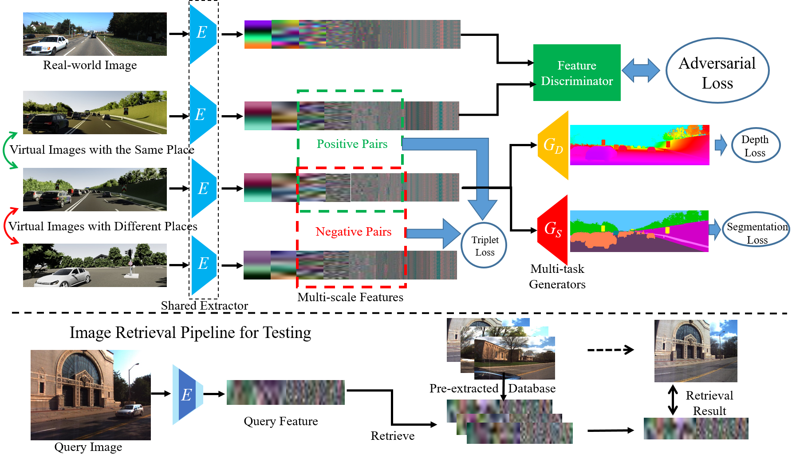

# DASGIL: Domain Adaptation for Semantic and Geometric-aware Image-based Localization

This is our Pytorch implementation for DASGIL ([paper](https://ieeexplore.ieee.org/document/9296559)) by [Hanjiang Hu](https://github.com/HanjiangHu), [Zhijian Qiao](https://github.com/qiaozhijian) and [Ming Cheng](https://mingcheng991129.github.io/). The work has been published in IEEE Transactions on Image Processing (TIP).





## Prerequisites
- Linux or macOS
- Python 3
- CPU or NVIDIA GPU + CUDA CuDNN

## Getting Started
### Installation
- Install requisite Python libraries.
```bash
pip install -r requirements.txt
```
- Clone this repo:
```bash
git clone https://github.com/HanjiangHu/DASGIL.git
```

### Training

[KITTI](http://www.cvlibs.net/datasets/kitti/index.php) and [Virtual KITTI 2](https://europe.naverlabs.com/research/computer-vision-research-naver-labs-europe/proxy-virtual-worlds-vkitti-2/) dataset are used to train the model, while [Extended CMU-Seasons](https://www.visuallocalization.net/datasets) dataset is used to test.
The datasets involved in this paper are well organized [HERE](https://drive.google.com/file/d/10yRZsyfX_Xc2GpY1Gpmv2UeVjCbEPDYD/view?usp=sharing). Please uncompress it under the root path. Our pretrained models with FD and CD are found [HERE](https://drive.google.com/file/d/1ll7U65KuGFr_rNKZkTOxdnzNzBWh4PmS/view). Please uncompress it under `./checkpoints`.

- Training on KITTI and Virtual KITTI Dataset (take FD model as an example, specify `--dis_type CD` to train and test CD model):
```
python train.py --name DASGIL_FD
```
- Fine-tune the pretrained model:
```
python train.py --name DASGIL_FD --continue_train --which_epoch 5
```
### Testing
- Testing on the Extended CMU-Seasons Dataset:
```
python test.py --name DASGIL_FD --which_epoch 5
```
### Results
The test results will be saved to `./output`. The txt results will be merged into a single txt file for all the slices and submitted to [the official benchmark website](https://www.visuallocalization.net/submission/).

Our [DASGIL-FD results](https://www.visuallocalization.net/details/15756/) and [DASGIL-CD results](https://www.visuallocalization.net/details/16834/)  could be found on the Extended CMU-Seasons benchmark website.


## Other Details
- See `./options/train_options.py` for training-specific flags, `./options/test_options.py` for test-specific flags, and `./options/base_options.py` for all common flags.
- CPU/GPU (default `--gpu_ids 0`): set`--gpu_ids -1` to use CPU mode (NOT recommended). Currently multi-GPU training is not supported.

If you use this code in your own work, please cite:

H. Hu, Zhijian Qiao, M. Cheng, Z. Liu and H. Wang
”[DASGIL: Domain Adaptation for Semantic and Geometric-aware Image-based Localization](https://ieeexplore.ieee.org/document/9296559)”,  

```
@ARTICLE{hu2020dasgil,
  author={H. {Hu} and Z. {Qiao} and M. {Cheng} and Z. {Liu} and H. {Wang}},
  journal={IEEE Transactions on Image Processing}, 
  title={DASGIL: Domain Adaptation for Semantic and Geometric-Aware Image-Based Localization}, 
  year={2021},
  volume={30},
  number={},
  pages={1342-1353},
  doi={10.1109/TIP.2020.3043875}}
```
